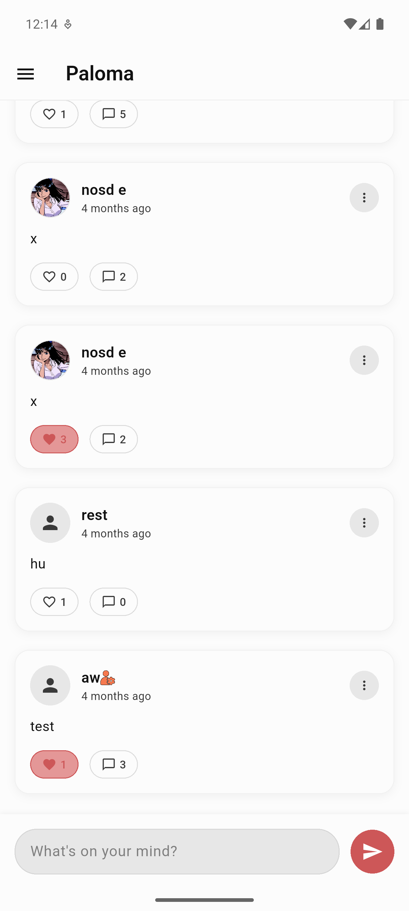
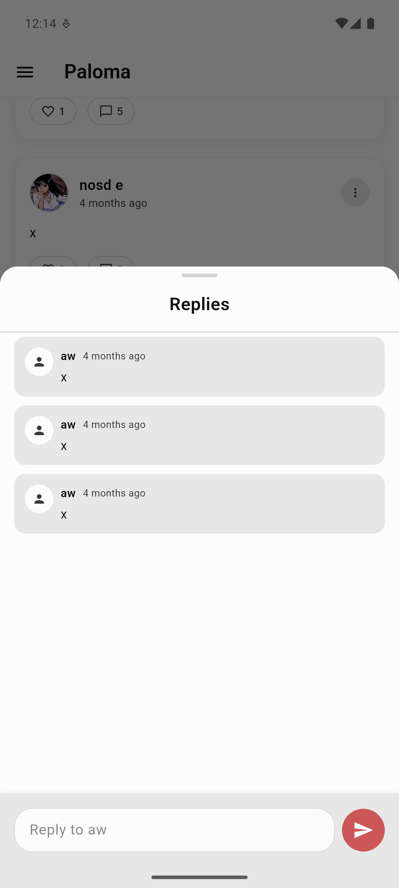
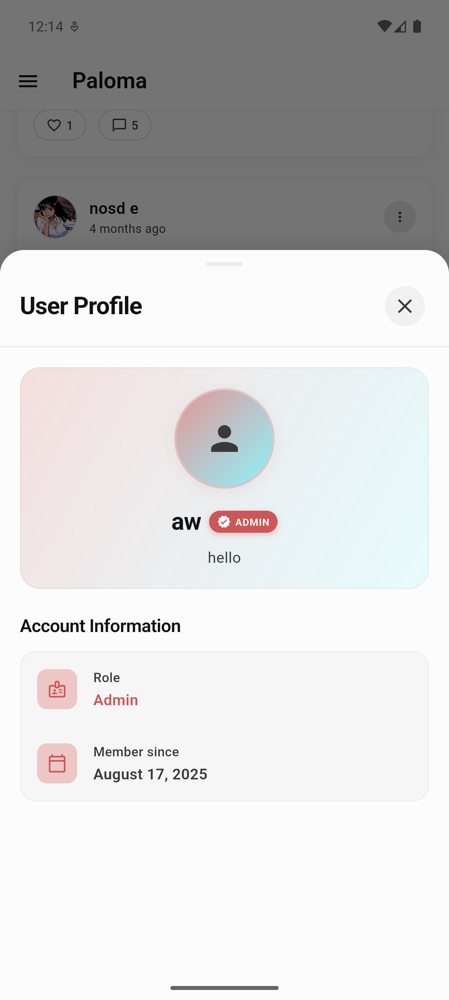
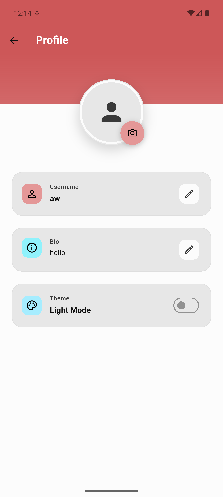
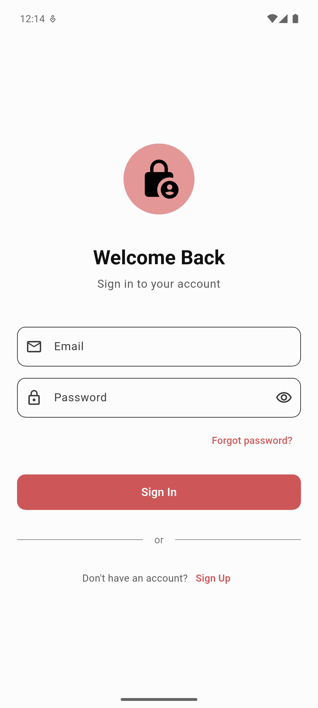
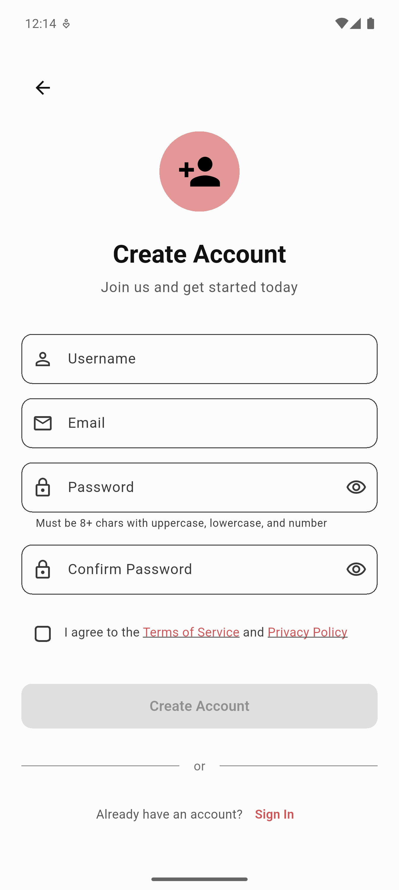

# Paloma 🐦

<p align="center">
  
</p>

<p align="center">
  A modern, beautiful social media application built with Flutter and Firebase. Share your thoughts, connect with others, and express yourself through posts, likes, and replies.
</p>


## 🚀 Try It Now

Want to experience Paloma right away? Download the latest release from our [GitHub Releases](https://github.com/your-username/paloma/releases) page!

### Download Options:
- **📱 Android APK**: Direct install for Android devices

## ✨ Features

- **🔐 Authentication**: Secure user authentication with Firebase Auth
- **📱 Real-time Posts**: Create and share posts with real-time updates
- **❤️ Like System**: Engage with content through likes
- **💬 Replies**: Comment and reply to posts
- **👤 User Profiles**: Customizable profiles with usernames, bios, and profile pictures
- **🎨 Dark/Light Themes**: Beautiful Material Design 3 theming with theme switching
- **👑 Role-based Access**: Admin and user role management
- **📸 Image Upload**: Profile picture management with Firebase Storage
- **🔄 Real-time Sync**: Live updates across all users
- **📱 Cross-platform**: Works seamlessly on Android and iOS

## 🏗️ Architecture

This project follows a clean, scalable architecture:

```
lib/
├── controllers/          # GetX controllers for state management
├── core/                 # Core functionality (routes, constants)
├── data/                 # Data layer (repositories, models)
├── presentation/         # Presentation layer
│   ├── screens/         # Screen widgets
│   └── widgets/         # Reusable UI components
└── main.dart            # Application entry point
```

### State Management
- **BLoC Pattern**: Complex state management for authentication and data streams
- **GetX**: Simple state management for UI controllers and navigation

### Design System
- **Material Design 3**: Modern Google design language
- **Flex Color Scheme**: Beautiful, consistent color theming
- **Custom Fonts**: Scheherazade New for elegant typography

## 🚀 Getting Started

### Prerequisites

- Flutter SDK (^3.8.1)
- Dart SDK (^3.0.0)
- Firebase project with Authentication, Firestore, and Storage enabled

### Installation

1. **Clone the repository**
   ```bash
   git clone https://github.com/your-username/paloma.git
   cd paloma
   ```

2. **Install dependencies**
   ```bash
   flutter pub get
   ```

3. **Configure Firebase**
   - Create a Firebase project at [Firebase Console](https://console.firebase.google.com/)
   - Enable Authentication, Firestore Database, and Storage
   - Add your Android/iOS apps and download the configuration files
   - Place `google-services.json` (Android) and `GoogleService-Info.plist` (iOS) in appropriate directories

4. **Configure Firebase Options**
   ```bash
   flutterfire configure
   ```

5. **Run the app**
   ```bash
   flutter run
   ```

## 📱 Screenshots

<p align="center">
  
  
  
</p>

<p align="center">
  
  
  
</p>

## 🛠️ Tech Stack

### Core Framework
- **Flutter**: Cross-platform UI framework
- **Dart**: Programming language

### Backend & Services
- **Firebase Authentication**: User authentication
- **Cloud Firestore**: NoSQL database for real-time data
- **Firebase Storage**: File storage for profile images

### State Management
- **BLoC**: Business logic components for complex state
- **GetX**: Lightweight state management and navigation

### UI & Design
- **Material Design 3**: Modern design system
- **Flex Color Scheme**: Advanced theming
- **Cupertino Icons**: iOS-style icons

### Additional Libraries
- **Cached Network Image**: Efficient image loading and caching
- **Image Picker**: Native image selection
- **Shared Preferences**: Local data persistence
- **Jiffy**: Date/time formatting
- **Shimmer**: Loading animations

## 📂 Project Structure

```
paloma/
├── android/              # Android-specific files
├── ios/                  # iOS-specific files
├── lib/                  # Flutter source code
│   ├── controllers/      # GetX controllers
│   ├── core/            # Core utilities and routes
│   ├── data/            # Data layer
│   ├── presentation/    # UI layer
│   └── main.dart        # App entry point
├── assets/              # Static assets (images, fonts)
├── test/                # Unit and widget tests
├── pubspec.yaml         # Dependencies and configuration
└── README.md           # Project documentation
```

## 🔧 Configuration

### Firebase Setup

1. Create collections in Firestore:
   - `users`: User profiles and metadata
   - `User_Posts`: Posts with likes and timestamps
   - `User_Posts/{postId}/Replies`: Nested replies collection

### Environment Variables

Configure your Firebase project ID in `lib/firebase_options.dart` (auto-generated by flutterfire).

## 🧪 Testing

Run tests with:
```bash
flutter test
```

Run integration tests:
```bash
flutter test integration_test/
```

## 🚢 Deployment

### Android
```bash
flutter build apk --release
flutter build appbundle --release
```

### iOS
```bash
flutter build ios --release
```

## 🤝 Contributing

1. Fork the repository
2. Create a feature branch (`git checkout -b feature/amazing-feature`)
3. Commit your changes (`git commit -m 'Add some amazing feature'`)
4. Push to the branch (`git push origin feature/amazing-feature`)
5. Open a Pull Request

## 📋 Roadmap

- [ ] Push notifications
- [ ] Direct messaging
- [ ] Stories feature
- [ ] Video posts support
- [ ] Advanced search and filters
- [ ] Multi-language support

## 📄 License

This project is licensed under the MIT License - see the [LICENSE](LICENSE) file for details.

## 🙏 Acknowledgments

- Flutter team for the amazing framework
- Firebase for robust backend services
- Material Design team for beautiful design guidelines
- Open source community for inspiration and tools

## 📞 Support

If you have any questions or issues, please open an issue on GitHub or contact the maintainers.

---

**Made with ❤️ using Flutter and Firebase**
